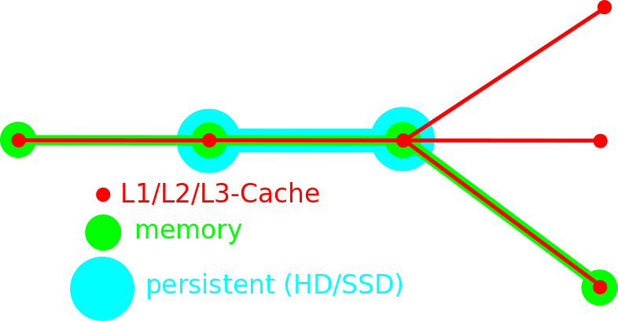
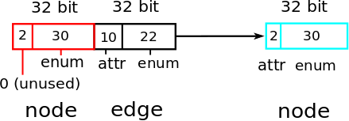

DISCLAIMER: There are still a lot of TODOS, the API will change and I haven't done a lot of benchmarking.

Intro
=====

judy-graph-db is a graph database based on [judy arrays](https://en.wikipedia.org/wiki/Judy_array). It was developed because there was no Haskell library that could handle very dense graphs with a million edges coming from a node. It currently is focused on analysing a static set of graph files (like the panama papers) and then to query it and do a little bit of post processing like adding, updating or deleting edges.

judy-graph-db should be
 - fast: Because of judy-arrays
 - typesave and convenient: The Cypher-like query [EDSL](https://wiki.haskell.org/Embedded_domain_specific_language) inspired by Neo4j eg enforces node/edge alternation. An EDSL has the advantage that we don't need to invent a big language like Cypher. There will never be a book written about this library, which IMHO what convenience is really about. Look at migration from Neo4j.
 - memory efficient: nodes are represented with Word32 indexes, edges also with Word32, if possible. Typeclasses are used to compress speed relevant properties into 32 bit.
 - flexible: Several typeclass graph instances balance between speed, memory efficiency and convenience
 - transparent: We explain all algorithms, and because of Haskell the library is easy to extend (if you are a Haskell programmer). As we use no monad apart from the IO-monad, there is only basic Haskell knowledge necessary.


On the downside (currently):
 - Deletion not tested and slows down the queries
 - No persistency yet
 - No thoughts on concurrency yet
 - No REST API yet (wich is maybe good for typesafety and: No standard passwords like MongoDB)
 - Cannot handle graphs that don't fit into memory
 - Judy Arrays are in IO. It is a binding to a C libary that is not easy to understand.

Overview
========

When a query or an algorithm is executed on the graph, it typically doesn't need to access all parts of the graph. It would be ideal if the programmer could influence where parts of the graph end up: L1/L2/L3-Cache, memory or HD/SSD.




Judy Arrays
===========



Graph Types
===========

JGraph
------


EnumGraph
---------


ComplexGraph
------------


Cypher EDSL
===========

A query tries to match a pattern on a graph. This pattern is an alternation between node and edge specifiers.

Node and Edge Specifiers
------------------------

Nodes can be specified
 - directly: ```node (nodes32 [0,1])```
 - as nodes in several labels labels: ```node (labels [ISSUE, PULL_REQUEST])```
 - as all nodes: ```node anyNode```

Edges are
 - attr
 - orth
 - where_
 - several

Pattern combinators
-------------------

An example how to combine node and edge specifiers, with ```--|``` and ```--|```. For all pattern combinators see []()
```Haskell
  query <- temp jgraph (simon --| raises |-- issue --| references |-- issue)
 where
  simon  = node (nodes32 [0]) :: CyN
  raises = edge (attr Raises) (attr Closes) :: CyE
  issue  = node (labels [ISSUE]) :: CyN
```

The output of the query:

```Bash
N [Nodes [0]],
E [],
N [Nodes2 [[3,4]]],
E [],
N [Nodes3 [[[5],[3,6],[],[]]]]]
```

This nesting of lists is equivalent to:


Executing Patterns
------------------
Patterns can be executed in several ways:
 - ```query <- table jgraph (p --> v)```
   ```table``` evaluates the query to [[Node]], like ```temp``` but flattens the output to a list of nodes on every layer.
 - ```t     <- temp jgraph (p --> v)```
   ```temp``` evaluates the query to values that can be reused in another query. A graph can be represented by layers of nested lists, from ```Nodes []``` to ```Nodes7 [[[[[[[]]]]]]]```.
 - ```diff  <- createMem jgraph (p --> v)```
   ```createMem``` adds/deletes edges if nodes have been added/deleted from the layers.

