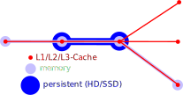
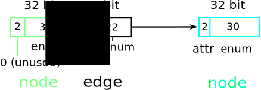
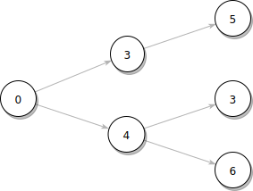

DISCLAIMER: There are still a lot of TODOS, the API will change and I haven't done a lot of benchmarking.

Intro
=====

judy-graph-db is a graph database based on [judy arrays](https://en.wikipedia.org/wiki/Judy_array). It was developed because there was no Haskell library that could handle very dense graphs with a million edges coming from a node. It currently is focused on analysing a static set of graph files (like the panama papers) and then to query it and do a little bit of post processing like adding, updating or deleting edges.

judy-graph-db should be
 - fast: Because of judy-arrays
 - typesave and convenient: The [Cypher](https://neo4j.com/developer/cypher-query-language/)-like query [EDSL](https://wiki.haskell.org/Embedded_domain_specific_language) eg enforces node/edge alternation. An EDSL has the advantage that we don't need to invent a big language like Cypher. There will never be a book written about this library, which IMHO is what convenience is really about. Look at [comparison to Neo4j](../master/doc/Neo4j.md).
 - memory efficient: nodes are represented with Word32 indexes, edges also with Word32, if possible. Typeclasses are used to compress speed relevant properties into 32 bit.
 - flexible: Several typeclass graph instances balance between speed, memory efficiency and convenience
 - transparent: We explain all algorithms, and because of Haskell the library is easy to extend (if you are a Haskell programmer). As we use no monad apart from the IO-monad, there is only basic Haskell knowledge necessary.


On the downside (currently):
 - Deletion not tested and slows down the queries
 - No persistency yet
 - No thoughts on concurrency yet
 - No REST API yet (wich is maybe good for typesafety and that there are no standard passwords like [MongoDB](https://www.theregister.co.uk/2017/01/11/mongodb_ransomware_followup/))
 - Cannot handle graphs that don't fit into memory
 - Judy Arrays are in IO. It is a binding to a C libary that is not easy to understand.

Overview
========

When a query or an algorithm is executed on the graph, it typically doesn't need to access all parts of the graph. We differentiate three parts:
 - A node can be represented just with its Word32-index. See the small red dot and lines in image below.
 - A node/edge could also concist of a record of Strings, Ints, ... . Visualized with the middle sized circles and lines
 - If it is critical that no data is ever lost, parts of the graph have to be persisted, see the big circle and lines.

If the strings are only needed in the final step of an algorithm while an int-counter and word32-index are mostly used, we try to store it in the red/small structure. It would be ideal if we could influence where parts of the graph end up: L1/L2/L3-Cache, memory or HD/SSD. With our construction of edges with continuous 32 bit values, we try to fit as much as possible into the L1/L2/L3 caches.



Most databases take away this control. For example they talk about [warming up](https://neo4j.com/developer/kb/warm-the-cache-to-improve-performance-from-cold-start/).

Judy Arrays
===========

Judy arrays are a key-value storage that promises very little cache misses when the key indexes are near to each other (They form the small/red structure): [Quote](http://www.nothings.org/computer/judy/): "If your data is often sequential, or approximately sequential (e.g. an arithmetic sequence stepping by 64), Judy might be the best data structure to use". This obviously means that only the lowest bits of the key should change in an innermost loop.

In a lot of graph algorithms you take a node, then you want to do something with all edges of a certain label. This label is encoded with attr bits (in the lower image we use 10 bits for the edge attr bits). Iterating all these edges is done with the lowest bits of the 64bit keys, called edge enum (using 22 bits in the lower image).
We use typeclasses to freely set the size of attr and enum bits to adapt this structure to your needs.



Being forced to put edge properties into 32 bit is a strong limitation. But we can use a trick that is used in the binary encoding of CPU instructions, that is giving the second 32 bit of the 64 bit key a different interpretation depending on the value of the first 32 bit.

Associate a Word32-node with a type
-----------------------------------
To use this CPU-trick we have to put nodes into classes.
In the examples we came up so far it was always possible to use a small set of classes (associate them with a type). In ghc core for example there are 10 different types of nodes/constructors:
 - functions, types, application, literals, ...
So a node is either a function node, a type node, ...

If the nodes have a lot more than 10 types, it is almost always possible to generalize them into no more than ~10 types.

Ranges to interpret edges differently
-------------------------------------
We have focused on analysing a set of static files. Therefore after sorting, it can be calculated how many type,function, application, ... - nodes there are and they can be put into a large file. Enumerating these nodes puts every type of node into an index range. If a query was made that returns a Word32 index of a node, we can find out in which range it is, therefore its type. And then we intepret the edge depending on the node type.

Typeclasses to convert Node/Edge-Attributes
-----------------------------------------
To increase readability and avoid erros, we use typeclasses to convert complex attributes into bits of a Word32.

```Haskell
class NodeAttribute nl where
    fastNodeAttr :: nl -> (Bits, Word32)
```

Graph Types
===========

You have the choice between
 - JGraph: Fast and memory effienct, but not usable in all cases
 - EnumGraph: An additional graph to enumerate edges that are not used continuously
 - ComplexGraph: Fast but not memory efficient. If node or edge attributes don't fit into 32 bit,
   there need to be additional Data.Map structures, but the judy arrays are kept for speed.

JGraph
------

The smallest graph needs just a judy array, index ranges and a counter

```Haskell
data (NodeAttribute nl, EdgeAttribute el) =>
  JGraph nl el = JGraph {
    judyGraphJ :: Judy,
    rangesJ :: NonEmpty (RangeStart, nl),
    nodeCountJ :: Word32
  }
```

EnumGraph
---------

If there are holes in the key range (the 32bit edge), it would be very inefficient to calulcate all child nodes by also visiting the holes. A second ```enumGraph``` is used to enumerate all edges.
As an example where this can happen, imagine a search engine that allows unicode in the search string. We make a tree that keeps a unicode value in every edge. But we don't want to test for all 32 bit values if an edge exists. Unfortuantely we sometimes want to know just all child edges of a node. The cypher queries can only be done with an EnumGraph because of this.

```Haskell
data (NodeAttribute nl, EdgeAttribute el) =>
  EnumGraph nl el = EnumGraph {
    judyGraphE :: Judy,
    enumGraph :: Judy,
    rangesE :: NonEmpty (RangeStart, nl),
    nodeCountE :: Word32
  }
```

ComplexGraph
------------

There are cases where properties cannot be compressed into 32 bit edges, but there is enough space for a convenient Data.Map-structure. On the other hand we still suspect the judy array to be faster. Some algoritms might only need the judy array, while another one needs more. We allow both. This is still in development. Might also be needed when the judy array overflows in 1% of the cases and then we need a bigger structure. For example you use only the latin characters from unicode and then a special character to force looking up in Data.Map (like utf8).


```Haskell
data (NodeAttribute nl, EdgeAttribute el) =>
  ComplexGraph nl el = ComplexGraph {
    judyGraphC :: Judy,
    enumGraphC :: Judy,
    complexNodeLabelMap :: Maybe (Map Word32 nl),
    complexEdgeLabelMap :: Maybe (Map (Node,Node) [el]),
    rangesC :: NonEmpty (RangeStart, nl),
    nodeCountC :: Word32
  }
```

Cypher EDSL
===========

A query tries to match a pattern on a graph. This pattern is an alternation between node and edge specifiers glued together with Pattern combinators.

Pattern combinators
-------------------

An example how to combine node and edge specifiers, with ```--|``` and ```|--``` and other [pattern combinators](https://github.com/tkvogt/judy-graph-db/blob/54a41b25c516cf232c3364301285444ec91d1cc8/src/JudyGraph/Cypher.hs#L62-L83):

```Haskell
  query <- temp jgraph (simon --| raises |-- issue --| references |-- issue)
 where
  simon  = node (nodes32 [0]) :: CyN
  raises = edge (attr Raises) :: CyE
  issue  = node (labels [ISSUE]) :: CyN
```

The output of the query:

```Bash
N [Nodes [0]],
E [],
N [Nodes2 [[3,4]]],
E [],
N [Nodes3 [[[5],[3,6]]]]
```

This nesting of lists is equivalent to:



Node Specifiers
---------------

Nodes can be specified
 - directly with Word32s: ```node (nodes32 [0,1])```
 - as nodes in several labels: ```node (labels [ISSUE, PULL_REQUEST])```
 - as all nodes: ```node anyNode```

Edge Specifiers
---------------

If all edges should be followed from a layer in a query use ```~~```, ```-->``` or ```<--```.

Otherwise use ```<--|```, ```|-->```, ```|--``` or ```--|``` with an edge specifier between the ```|```.
The edges that should be followed can be restricted by one or several arguments to the ```edge```-function:
```haskell
--| (edge (attr KNOWS) (attr LOVES) (1…3)) |-->
```

 - ```(attr LABEL)``` follows all LABEL-edges, adding ```attr LABEL_2``` means that these edges are also followed
 - ```(orth LABEL)``` This had to be introduced to allow the "or": ```|``` in ```(m)<-[:KNOWS|:LOVES]-(n)```.
It can only be applied to labels whose bit represenation is orthogonal. Imagine this like vectors in vector space that form a base. And now we have a convenient notation to follow all combinations.

   For example as we encode labels with binary: ```LABELA = 0b001, LABELB = 0b010, LABELC = 0b100```.
   
   Now ```(orth LABELA) (orth LABELB)``` creates the 2²-1 attrs: 0b010, 0b100, 0b110 (leaving away 0b000)
   
   and ```(orth LABELA) (orth LABELB) (orth LABELC)``` creates the 2³-1 attrs:
   
   0b001, 0b010, 0b011, 0b100, 0b101, 0b110, 0b111 (leaving away 0b000).

   As you can see you can't use too many ```orth``` arguments.
 - ```(where_ filt)``` This is like the WHERE you know from SQL or Cypher. The only difference to Cypher is that it only applies to one edge specifier. If the WHERE should be applied globally on several edge specifiers, you have to do this calculation yourself. TODO: Example
 - ```(1…3)``` (Alt Gr + .) or ```(1...3)``` means that the edge has to be followed between 1 and 3 times.
   Should be equivalent to ```(m)-[*1..3]->(n)``` in Neo4j.
   ```m --| (edge **) |-->``` means that an arbitrary number of edges is folowed.
   Should be equivalent to ```(m)-[*]->(n)``` in Neo4j

Directed and undirected edges
-----------------------------

A normal edge is directed:


If we connect 0 with with 1, we can take 0 and know that it is connected with 1, but if we take 1, we don't know that there is an incoming edge from 0. Therefore IF it is needed for an algorithm, we add another edge from 1 to 0 and mark it as opposite.
An undirected edge can be achieved by an edge from 0 to 1, and an edge from 1 to 0.

Evaluating Patterns
------------------
Patterns can be executed in several ways:
 - ```t     <- temp jgraph (p --> v)```

   ```temp``` evaluates the query to values that can be reused in another query. A graph can be represented by layers of nested lists, from ```Nodes [Node]``` to ```Nodes7 [[[[[[[Node]]]]]]]```.

 - ```query <- table jgraph (p --> v)```

   ```table``` works like ```temp``` but flattens the output to a list of nodes on every layer: [[Node]].

 - ```diff  <- createMem jgraph (p --> v)```

   ```createMem``` adds/deletes edges if nodes have been added/deleted from the layers.

Query Processing
----------------

In most queries the author had an evaluation in mind that is executed from left to right.
This is quicker because no evaluation strategy has to be found. Use ```qtemp```, ```qtable```
 - ```query <- qtemp jgraph (p --> v)```
 - ```query <- qtable jgraph (p --> v)```

Other queries can be very slow without an evaluation strategy, thats why all databases have a strategy how to evaluate a query [efficiently](https://en.wikipedia.org/wiki/Query_optimization). Our strategy is implemented [here](https://github.com/tkvogt/judy-graph-db/blob/54a41b25c516cf232c3364301285444ec91d1cc8/src/JudyGraph/Cypher.hs#L574-L669).

Sketch of how this works:
 - Differentiate three complexity classes for node specifiers:
    - small: Nodes directly given
    - middle: label(s) given
    - big: any node

 - Search for the smallest node specifier.
 - In case several node specifiers have equal complexity, the leftmost is evaluated first.
 - Evaluate a node layer and see if node sets on the left or right are smaller.
   Then calculate the smaller node set by visiting the adjacent edges.
 - Repeat until all node/edge specifiers are evaluated

Examples
========

In the first example we show how to use node attribute bits an how to use every bit of a 32 bit edge.
The second example explains why we needed an extra graph (EnumGraph) to enumerate all child edges.

OpenGL-Picking
--------------
An interative editor for meshes needs to highlight nodes/edges that are located under the mouse cursor. After translating the screen coordinates into object coordinates, the nodes in a certain distance from the cursor have to be returned.

For the nodes we use:
 - Two node attr bits to mark a node as selected/hovered over.

For the edges we divide the space into a table of cells that contain nodes:
 - 12 bits for x-coordinate, amother 12 bits for y-coordinate. This means 4096x4096 cells. The 8 bits rest is used to store up to 254 nodes in every cell.

Assuming an even distribution this can hold a maximum of 4096x4096x254 x (8+4) bytes= ~ 52 GB, which is more than what fits into the memory of current affordable machines. So the limits are not the 32 bits, but the amount of total nodes and an uneven distribution.
In the cells there are 254 32-bit values, which enode two float values for (x,y)-coordinates, followed by a 32-bit node index.

Search Engine
-------------

EnumGraph necessary
