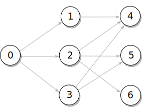

DISCLAIMER: There are still a lot of TODOS, the API will change and I haven't done a lot of benchmarking.

Intro
=====

judy-graph-db is a graph database based on [judy arrays](https://en.wikipedia.org/wiki/Judy_array). It was developed because there was no Haskell library that could handle very dense graphs with a million edges coming from a node. It currently is focused on analysing a static set of graph files (like the panama papers) and then to query it and do a little bit of post processing like adding, updating or deleting edges.

judy-graph-db should be
 - fast: Because of judy-arrays
 - typesave and convenient: The [Cypher](https://neo4j.com/developer/cypher-query-language/)-like query [EDSL](https://wiki.haskell.org/Embedded_domain_specific_language) eg enforces node/edge alternation. An EDSL has the advantage that we don't need to invent a big language like Cypher. There will never be a book written about this library, which IMHO what convenience is really about. Look at migration from Neo4j.
 - memory efficient: nodes are represented with Word32 indexes, edges also with Word32, if possible. Typeclasses are used to compress speed relevant properties into 32 bit.
 - flexible: Several typeclass graph instances balance between speed, memory efficiency and convenience
 - transparent: We explain all algorithms, and because of Haskell the library is easy to extend (if you are a Haskell programmer). As we use no monad apart from the IO-monad, there is only basic Haskell knowledge necessary.


On the downside (currently):
 - Deletion not tested and slows down the queries
 - No persistency yet
 - No thoughts on concurrency yet
 - No REST API yet (wich is maybe good for typesafety and that there are no standard passwords like MongoDB)
 - Cannot handle graphs that don't fit into memory
 - Judy Arrays are in IO. It is a binding to a C libary that is not easy to understand.

Overview
========

When a query or an algorithm is executed on the graph, it typically doesn't need to access all parts of the graph. It would be ideal if we could influence where parts of the graph end up: L1/L2/L3-Cache, memory or HD/SSD.


Judy Arrays
===========


Being forced to put edge properties into 32 bit is a strong limitation. But we can use a trick that is used in the binary encoding of CPU instructions, that is giving the second 32 bit of the 64 bit key a different interpretation depending on the value of the first 32 bit.

Associate a Word32-node with a type
-----------------------------------
In the examples we came up so far it was always possible to put nodes into a small set of classes (associate them with a type). In ghc core for example there are 9 different types of nodes/constructors:
 - functions, types, application, literals, ...
If the nodes have a lot more than 10 types, it is almost always possible to generalize them into no more than ~10 types.

Ranges to interpret edges differently
-------------------------------------
We have focused on analysing a set of static files. Therefore after sorting it can be calculated how many type,function, application, ... - nodes there are and they can be put into a large file. Enumerating these nodes puts every type of node into an index range. If a query was made that returns a Word32 index of a node, we can find out in which range it is, therefore its type. And then we intepret the edge depending on the node type.


Graph Types
===========

JGraph
------

The smallest graph needs just a judy array, index ranges and a counter

```Haskell
data (NodeAttribute nl, EdgeAttribute el) =>
  JGraph nl el = JGraph {
    judyGraphJ :: Judy,
    rangesJ :: NonEmpty (RangeStart, nl),
    nodeCountJ :: Word32
  }
```

EnumGraph
---------

If there are holes in the key range, it would be very inefficient to calulcate all child nodes by enumerating the keys. A second ```enumGraph``` is used to enumerate all edges.
As an example where this can happen, imagine a search engine that allows unicode in the search string. We put a unicode value in the edge, not all unicodes appear, but we might want to know how all child nodes of a node.

```Haskell
data (NodeAttribute nl, EdgeAttribute el) =>
  EnumGraph nl el = EnumGraph {
    judyGraphE :: Judy,
    enumGraph :: Judy,
    rangesE :: NonEmpty (RangeStart, nl),
    nodeCountE :: Word32
  }
```

ComplexGraph
------------

There are cases where properties cannot be compressed into 32 bit edges, but there is enough space for a convenient Data.Map-structure. On the other hand we still suspect the judy array to be faster. Some algoritms might only need the judy array, while another needs more. We allow both. This is still in development. Might also be needed when the judy array overflows in 1% of the cases and then we need a bigger structure. For example you use only the latin characters from unicode and then a special character to force looking up in Data.Map (like utf8).


```Haskell
data (NodeAttribute nl, EdgeAttribute el) =>
  ComplexGraph nl el = ComplexGraph {
    judyGraphC :: Judy,
    enumGraphC :: Judy,
    complexNodeLabelMap :: Maybe (Map Word32 nl),
    complexEdgeLabelMap :: Maybe (Map (Node,Node) [el]),
    rangesC :: NonEmpty (RangeStart, nl),
    nodeCountC :: Word32
  }
```

Cypher EDSL
===========

A query tries to match a pattern on a graph. This pattern is an alternation between node and edge specifiers.

Node and Edge Specifiers
------------------------

Nodes can be specified
 - directly: ```node (nodes32 [0,1])```
 - as nodes in several labels labels: ```node (labels [ISSUE, PULL_REQUEST])```
 - as all nodes: ```node anyNode```

Edges are
 - attr
 - orth
 - where_
 - several

Pattern combinators
-------------------

An example how to combine node and edge specifiers, with ```--|``` and ```--|```. For all pattern combinators see []()
```Haskell
  query <- temp jgraph (simon --| raises |-- issue --| references |-- issue)
 where
  simon  = node (nodes32 [0]) :: CyN
  raises = edge (attr Raises) (attr Closes) :: CyE
  issue  = node (labels [ISSUE]) :: CyN
```

The output of the query:

```Bash
N [Nodes [0]],
E [],
N [Nodes2 [[3,4]]],
E [],
N [Nodes3 [[[5],[3,6]]]]
```

This nesting of lists is equivalent to:



Executing Patterns
------------------
Patterns can be executed in several ways:
 - ```t     <- temp jgraph (p --> v)```

   ```temp``` evaluates the query to values that can be reused in another query. A graph can be represented by layers of nested lists, from ```Nodes [Node]``` to ```Nodes7 [[[[[[[Node]]]]]]]```.

 - ```query <- table jgraph (p --> v)```

   ```table``` works like ```temp``` but flattens the output to a list of nodes on every layer: [[Node]].
 - ```diff  <- createMem jgraph (p --> v)```

   ```createMem``` adds/deletes edges if nodes have been added/deleted from the layers.

Examples
========
In the first example we show how to use node attribute bits an how to use every bit of a 32 bit edge.
The second example explains why we needed an extra graph (EnumGraph) to enumerate all child edges.

OpenGL-Picking
--------------
An interative editor for meshes needs to highlight nodes/edges that are located under the mouse cursor. After translating the screen coordinates into object coordinates, the nodes in a certain distance from the cursor have to be returned.

For the nodes we use:
 - Two node attr bits to mark a node as selected/hovered over.

For the edges we divide the space into a table of cells that contain nodes:
 - 12 bits for x-coordinate, amother 12 bits for y-coordinate. This means 4096x4096 cells. The 8 bits rest is used to store up to 254 nodes in every cell.

Assuming an even distribution this can hold a maximum of 4096x4096x254 x (8+4) bytes= ~ 52 GB, which is probably more than what fits into the memory of current machines. So the limits are not the 32 bits, but the amount of total nodes and an uneven distribution.
In the cells there are 254 32-bit values, which enode two float values for (x,y)-coordinates, followed by a 32-bit node index.

Search Engine
-------------

EnumGraph necessary
